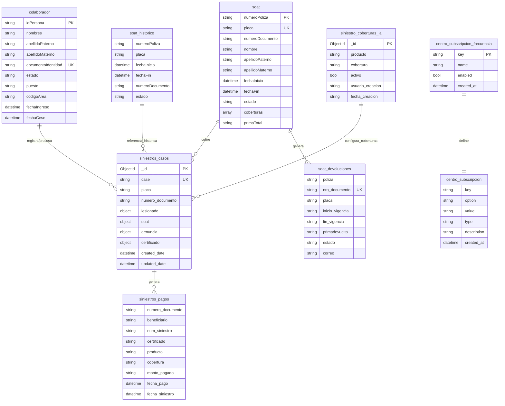

# Bases de datos

## Información General

El sistema utiliza **MongoDB** como base de datos principal. La base de datos se denomina **`buc-data`** y almacena toda la información relacionada con siniestros, pólizas SOAT, colaboradores y configuraciones del sistema.

**Características técnicas:**
- **Motor de base de datos:** MongoDB
- **Nombre de la base de datos:** `buc-data`
- **Tipo:** Base de datos NoSQL orientada a documentos
- **Driver:** MongoDB Go Driver (`go.mongodb.org/mongo-driver`)
- **Configuración:** Soporta autenticación SSL, pool de conexiones y clusters

## Diagrama de Base de Datos

## Descripción de Tablas

| Tabla | Descripción | Propósito Principal |
|-------|-------------|---------------------|
| **colaborador** | Almacena información de los colaboradores activos y cesados de la organización | Validar y obtener datos de colaboradores que reportan o procesan siniestros |
| **soat** | Contiene las pólizas SOAT vigentes con información del asegurado y del vehículo | Consultar pólizas activas para validar cobertura en reportes de siniestros |
| **soat_historico** | Registro histórico de pólizas SOAT que ya no están vigentes | Consultar información de pólizas en fechas pasadas para casos de siniestros retroactivos |
| **soat_devoluciones** | Registra las devoluciones de primas de pólizas SOAT | Gestionar y consultar solicitudes de devolución de primas pagadas |
| **siniestros_casos** | Almacena todos los casos de siniestros reportados con su información completa | Gestionar el ciclo de vida completo de un caso de siniestro desde su registro hasta su resolución |
| **siniestros_pagos** | Contiene el historial de pagos realizados por concepto de siniestros | Consultar pagos previos y verificar historial de indemnizaciones por beneficiario |
| **siniestro_coberturas_ia** | Configuración de coberturas habilitadas para procesamiento con IA | Determinar qué combinaciones de producto-cobertura pueden ser procesadas automáticamente por IA |
| **centro_subscripcion** | Almacena opciones de configuración del centro de suscripciones | Gestionar configuraciones personalizables del sistema de suscripciones |
| **centro_subscripcion_frecuencia** | Define las frecuencias de suscripción disponibles en el sistema | Configurar y gestionar las opciones de frecuencia para suscripciones |

## Relaciones Principales

### Colaborador → Siniestros
- Los **colaboradores** pueden registrar y procesar **casos de siniestros**
- Relación: Un colaborador puede gestionar múltiples casos de siniestros
- Campo de relación: `documentoIdentidad` en colaborador → `numero_documento` en siniestros_casos (cuando el colaborador es el asegurado/solicitante)

### SOAT → Siniestros
- Las **pólizas SOAT** cubren los **siniestros reportados**
- Relación: Una póliza SOAT puede tener múltiples siniestros asociados
- Campo de relación: `placa` en soat → `placa` en siniestros_casos
- También existe relación con `numeroDocumento` → `numero_documento`

### SOAT Histórico → Siniestros
- El **historial de SOAT** proporciona información de pólizas para siniestros con fecha de ocurrencia pasada
- Relación: Se consulta por placa y rango de fechas (`fechaInicio` y `fechaFin`)
- Campo de relación: `placa` + validación de fechas

### SOAT → Devoluciones
- Las **pólizas SOAT** pueden generar **solicitudes de devolución**
- Relación: Una póliza puede tener una devolución asociada
- Campo de relación: `numeroPoliza` en soat → `poliza` en soat_devoluciones

### Siniestros → Pagos
- Los **casos de siniestros** generan **registros de pagos** cuando son aprobados
- Relación: Un caso de siniestro puede generar múltiples pagos (por diferentes coberturas)
- Campo de relación: Múltiples campos relacionados (`numero_documento`, `num_siniestro`)

### Coberturas IA → Siniestros
- La configuración de **coberturas IA** determina qué siniestros pueden procesarse automáticamente
- Relación: Define qué combinaciones de producto-cobertura están habilitadas para IA
- Uso: Validación por `producto` y `cobertura` con estado `activo = true`

### Centro Suscripción → Frecuencias
- El **centro de suscripción** utiliza las **frecuencias definidas**
- Relación: Las opciones de suscripción referencian frecuencias disponibles
- Campo de relación: `key` en centro_subscripcion_frecuencia
- Filtro: Solo frecuencias con `enabled = true`

### Índices Principales Recomendados

Para optimizar las consultas más frecuentes, se recomienda mantener los siguientes índices:

1. **colaborador**: `documentoIdentidad`, `estado`
2. **soat**: `placa`, `numeroDocumento`, `fechaInicio`, `fechaFin`
3. **soat_historico**: `placa` + `fechaInicio` + `fechaFin` (índice compuesto)
4. **soat_devoluciones**: `nro_documento`
5. **siniestros_casos**: `case`, `placa`, `numero_documento`, `created_date`
6. **siniestros_pagos**: `numero_documento`, `fecha_pago_time` (ordenamiento descendente)
7. **siniestro_coberturas_ia**: `producto` + `cobertura` + `activo` (índice compuesto)
8. **centro_subscripcion_frecuencia**: `enabled`

